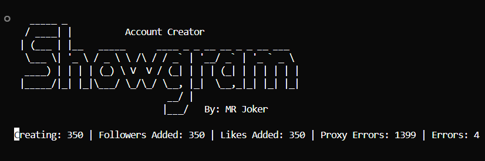
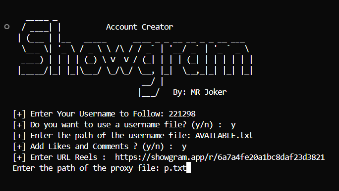

<p align="center">
  
</p>

<p align="center">
  <b>Automated account creation & engagement toolkit for Showgram</b>
</p>

<p align="center">
  
  
  
</p>

---

## Overview

**Showgram Account Creator** is a high-performance automation tool built for the [Showgram](https://showgram.app) platform.  
It creates fresh accounts at scale, then uses them to grow your presence through follows, reel views, likes, and comments.

Every generated account is set up with a **realistic Arabic display name** (Gulf & Levant style) so profiles look natural — not like bot farms.

---

## Features

| | Capability |
|---|---|
| :busts_in_silhouette: | **Mass account creation** with multi-threading |
| :handshake: | **Auto-follow** your target username on every new account |
| :eyes: | **Reel view boost** for higher reach |
| :heart: | **Auto likes** on a selected reel |
| :speech_balloon: | **Random comments** for organic-looking engagement |
| :bust_in_silhouette: | **Realistic names** generated from a large Gulf & Levant name pool |
| :file_folder: | **Custom username lists** or auto-generated usernames |
| :globe_with_meridians: | **Proxy support** for safer, scalable runs |
| :floppy_disk: | **Auto-save** created accounts to `Done_Creating.txt` |

---

## Requirements

- Python 3.8+
- `requests`
- A working **proxy list** file
- *(Optional)* A username list file for custom handles

```bash
pip install requests
```

---

## How to Run

```bash
python Account_Creator.py
```

<p align="center">
  
</p>

---

## Usage Guide

When you launch the tool, you’ll be guided through a short setup flow:

### 1. Target username to follow
Enter **your Showgram username**.  
Every account created by the tool will automatically follow this profile.

```
[+] Enter Your Username to Follow: 221298
```

### 2. Username source
Choose how new accounts get their usernames:

| Input | Behavior |
|:-----:|----------|
| `y` | Load usernames from a file (recommended for short / rare handles) |
| `n` or *Enter* | Let the tool generate usernames automatically |

```
[+] Do you want to use a username file? (y/n) :  y
[+] Enter the path of the username file: AVAILABLE.txt
```

### 3. Reel engagement (likes + comments + views)
Enable interaction with a specific reel:

| Input | Behavior |
|:-----:|----------|
| `y` | Boost the reel (views, likes, random comments) — then paste the reel URL |
| `n` or *Enter* | Skip engagement and only create + follow |

```
[+] Add Likes and Comments ? (y/n) :  y
[+] Enter URL Reels :  https://showgram.app/r/xxxxxxxx
```

### 4. Proxy file
Provide the path to your proxies file (one proxy per line).

```
Enter the path of the proxy file: p.txt
```

After setup, the live counter starts:

```
Creating | Followers Added | Likes Added | Proxy Errors | Errors
```

Created accounts are saved to **`Done_Creating.txt`** in this format:

```
username:password | token
```

---

## Important Note

> :warning: **Auto-generated usernames** are short by default (**5 characters**).  
> You can change this in `Account_Creator.py` at **line 154** (`self.username_length`).
>
> Changing it to a very short length is **not recommended** — checking availability for short usernames can be slow and wasteful.
>
> Prefer collecting available short usernames first with the companion tool, then feed that file into Account Creator (`y` on the username-file prompt).

### Companion tool — Showgram Username

Extract available Showgram usernames and export them as a ready-to-use list:

**Repository:** [https://github.com/vv1ck/Showgram-Username](https://github.com/vv1ck/Showgram-Username)

---

## Project Structure

```text
Showgram/
├── Account_Creator.py   # Main tool
├── start.png            # Banner
├── Account_Creator.png  # Setup preview
├── Done_Creating.txt    # Created accounts output
├── p.txt                # Proxies (your file)
└── README.md
```

---

## Disclaimer

This project is provided for **educational and research purposes** only.  
You are solely responsible for how you use it and for complying with Showgram’s terms of service and applicable laws.

---

## Connect

<p align="center">
  <a href="https://t.me/vv0ck">
    
  </a>
  &nbsp;
  <a href="https://instagram.com/221298r">
    
  </a>
</p>

<p align="center">
  <b>MR Joker</b><br>
  <a href="https://t.me/vv0ck">t.me/vv0ck</a> · <a href="https://instagram.com/221298r">instagram.com/221298r</a>
</p>

---

<p align="center">
  <sub>Made with focus by <b>MR Joker</b> — Showgram Account Creator</sub>
</p>
